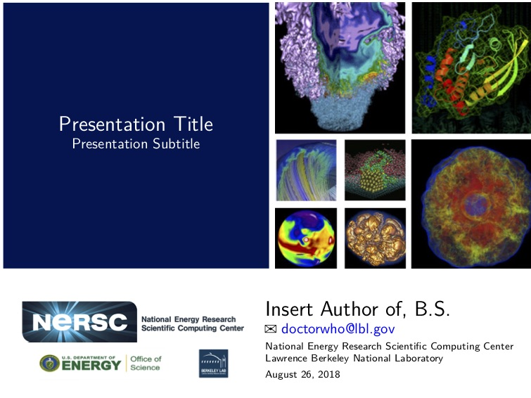
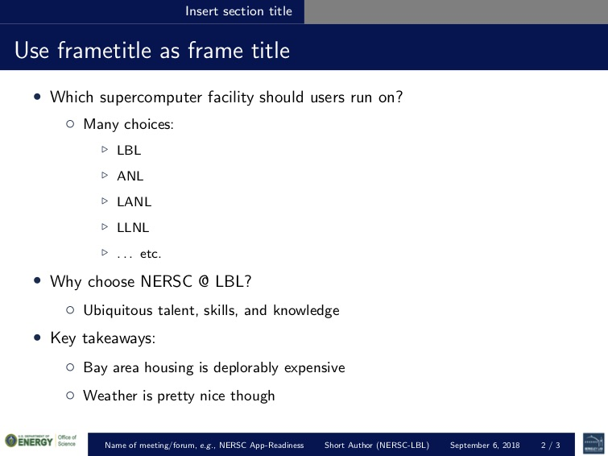
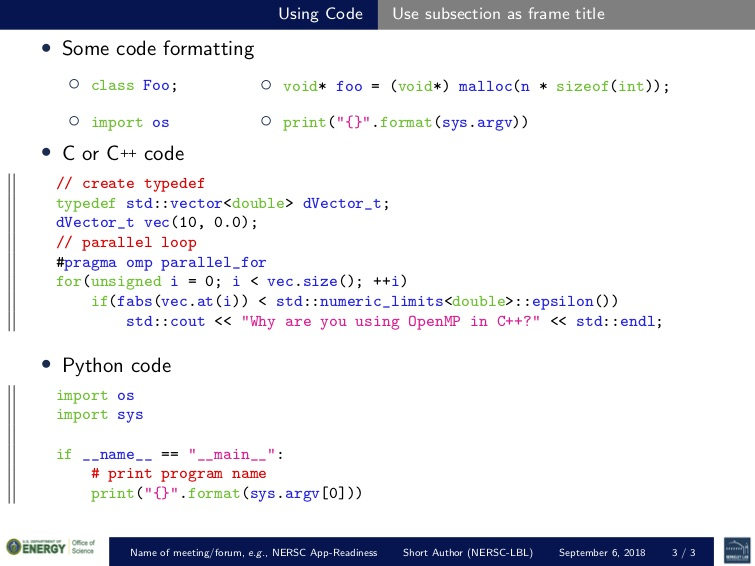

# NERSC LaTeX Presentation Template

LaTeX template for presentations by NERSC staff. It is based on of the beamer package.

## Requirements

- `pdflatex` or `xelatex`
- `TexLive` packages
  - bbding
  - xcolor
  - amssymb
  - amsmath
  - import
  - relsize
  - textcomp
  - listings
  - csquotes
  - parskip
  - babel

## Preview







## Getting started

```tex
\documentclass{nersc}

\title[Short title]{Full title}
\subtitle{Subtitle}
\author[Short author]{{\Large Author name}\\
    \email{email@lbl.gov}}
\meeting{Name of meeting}

\begin{document}

% create title slide
\begin{frame}[label=title,plain]
    \maketitle
\end{frame}

\section{Section name}
\subsection{Subsection name}

% create a slide
\begin{frame}[t]
    \frametitle{Title for slide}
    \begin{itemize}
        \item CMake
    \end{itemize}
\end{frame}

```