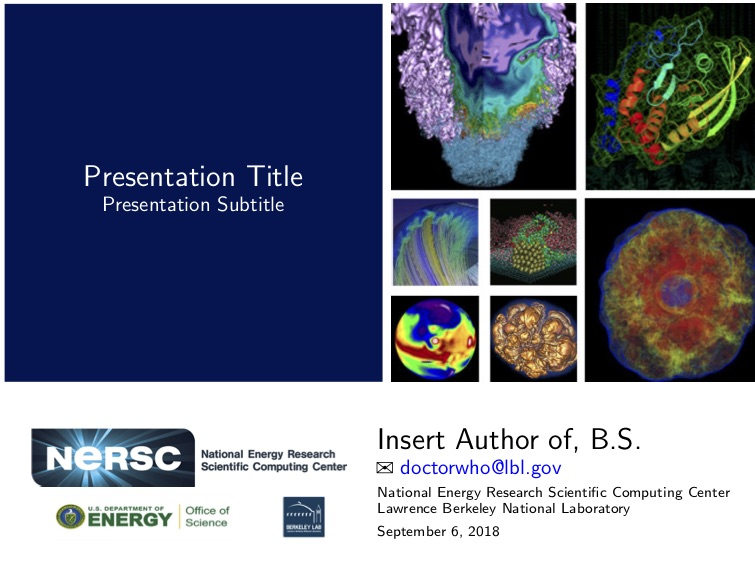

# NERSC LaTeX Presentation Template

LaTeX template for presentations by NERSC staff. It is based on the beamer package.

## Requirements

- `pdflatex` or `xelatex`
- `TexLive` packages
  - bbding
  - xcolor
  - amssymb
  - amsmath
  - import
  - relsize
  - textcomp
  - listings
  - csquotes
  - parskip
  - babel

## Preview

### Title Slide



### Sample Slide #1


### Sample Slide #2


## Getting started

#### Create a LaTeX file with extension `.tex`
```tex
\documentclass{nersc}

\title[Short title]{Full title}
\subtitle{Subtitle}
\author[Short author]{{\Large Author name}\\
    \email{email@lbl.gov}}
\meeting{Name of meeting}

\begin{document}

% create title slide
\begin{frame}[label=title,plain]
    \maketitle
\end{frame}

\section{Section name}
\subsection{Subsection name}

% create a slide
\begin{frame}[t]
    \frametitle{Title for slide}
    \begin{itemize}
        \item Content
    \end{itemize}
\end{frame}

\end{document}
```

#### Run `make`

```shell
$ make
```

## Notes

- `make clean` tries to delete all the intermediate TeX files but not the PDF files
- `make distclean` does `make clean` plus `rm -f *.pdf`
- Default image extension is `.jpg` and default path to look for images in `./images/`
- Default path of child/include TeX files is `./sections/` and `./data/`
- LaTeX build log is output to `./build.log` by default
    - To change this behavior, edit `OUTPUT` variable in Makefile
- Default PDF tool is `pdflatex`
    - To change this behavior, edit `TEXTOOL` variable in Makefile, e.g. `TEXTOOL=xelatex`
- `make compress` will attempt to compress any PDFs found in directory
    - If this results in negligible compression, run the `./create_jpeg.sh` script to convert images to JPEG format
